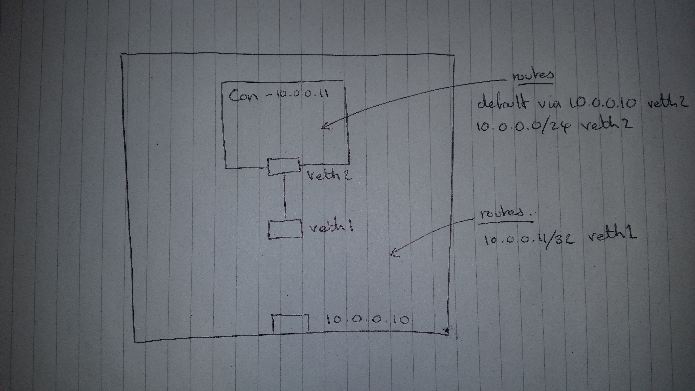
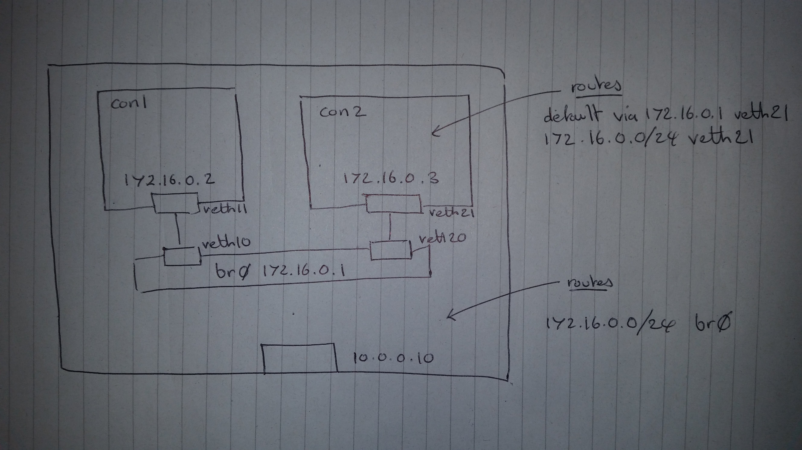
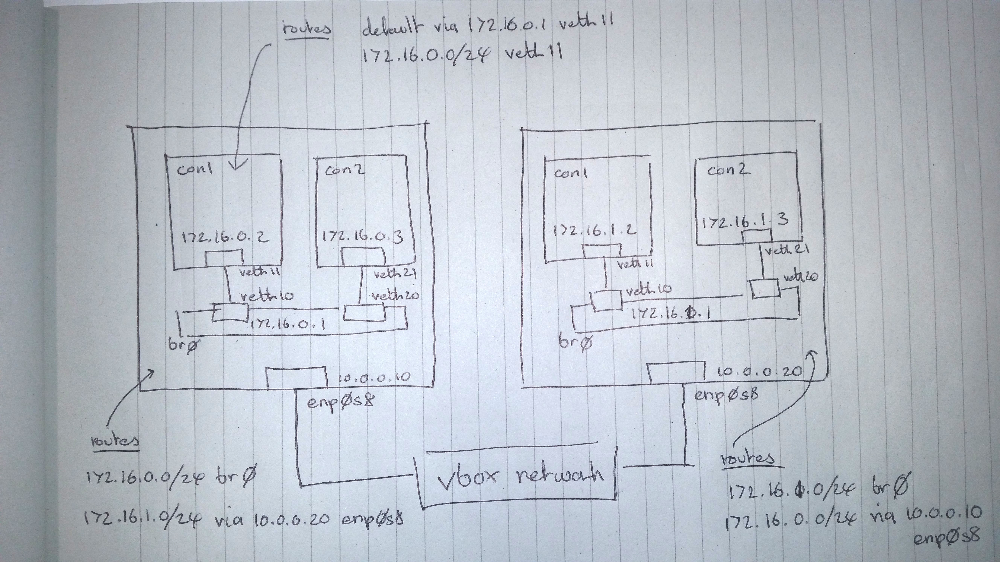
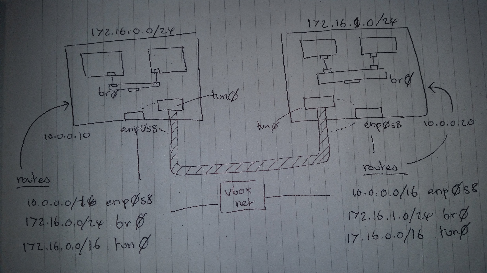

The aim
-------

The network needs to satisfy the following (Kubenetes) requirements:

* All containers can communicate with all other containers without NAT

* All nodes can communicate with all containers (and vice-versa) without NAT

* The IP that a container sees itself as is the same IP that others see it as

The plan
--------

To work our way from nothing, to a (flannel style) overlay network in 4 'easy' steps:

* Step 1: Single network namespace

* Step 2: Single node

* Step 3: Multi node

* Step 4: Overlay network 

Links
-----

* https://github.com/kristenjacobs/container-networking

.. header::
    container networking from scratch
